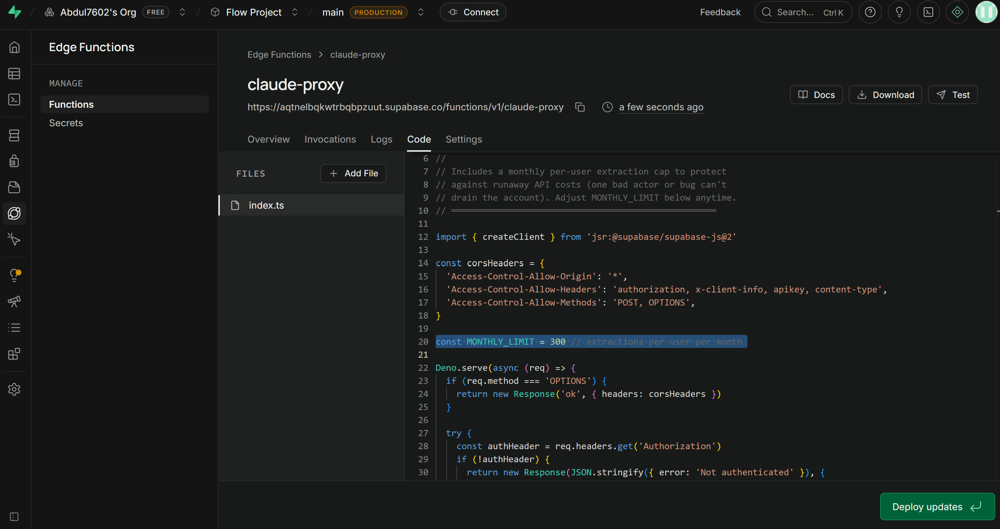

# Adjusting the Monthly Extraction Limit

Flow caps how many AI note-extractions each user can run per month, to protect against runaway Anthropic API costs (a bug, a bad actor, or unexpected viral growth can't drain the account overnight).

## Where it lives

The limit is one line in the `claude-proxy` Edge Function (code line no:20):

```ts
const MONTHLY_LIMIT = 300 // extractions per user per month
```

## How to change it

1. Go to the Supabase dashboard for this project:
   **https://supabase.com/dashboard/project/aqtnelbqkwtrbqbpzuut/functions/claude-proxy/code**
2. Edit the `MONTHLY_LIMIT` number on line 20 to whatever value makes sense.
3. Click **Deploy updates** (bottom right).
4. That's it — no other files need to change, no database migration needed.



## What number to pick

Rule of thumb: at **Claude Haiku 4.5** pricing, one extraction costs roughly **$0.001–0.002**. So:

| Limit/month | Rough cost ceiling per user/month |
|---|---|
| 100  | ~$0.10–0.20 |
| 300  | ~$0.30–0.60 *(current default)* |
| 1000 | ~$1–2 |

Considerations for raising or lowering it:
- **Lower it** if API credits are tight, or if early usage data shows most real users stay well under the current number anyway (no point being generous if nobody needs it).
- **Raise it** if paying/engaged users are hitting the wall doing genuinely normal daily use — that's a sign the cap is too tight, not that users are abusing it.
- Once there's a paid tier, this becomes a **per-tier** value instead of one global constant — free users get a low cap, paying users get a much higher (or unlimited) one. That's a bigger change (reading the user's plan from the database) and not built yet.

## After changing it

The change is live immediately for all users on their next note extraction — no app update, no redeploy of the frontend, no waiting for anything to propagate beyond the Edge Function deploy itself.
